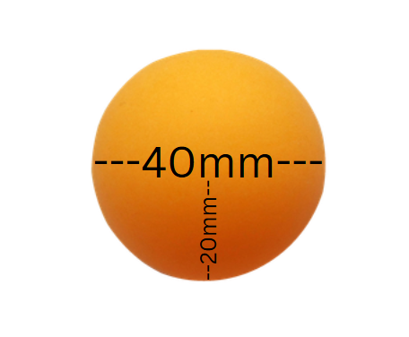
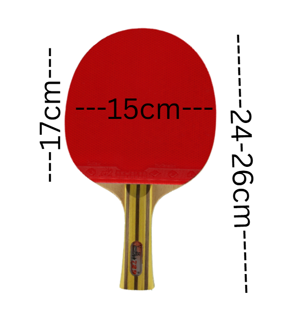
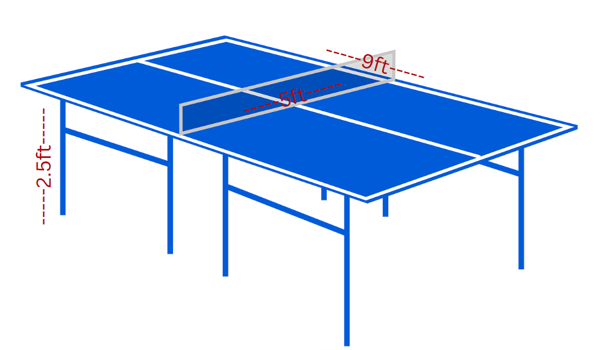

# GDD questions

## Overview

We are creating a 3D ping pong game that simulates the fast-paced and competitive nature of table tennis. The game emphasizes realistic physics, intuitive controls, and dynamic visuals to provide players with an engaging and immersive experience.

---

## Objective Statement

The prototype seeks to answer the question:  
*"How can we effectively replicate the tactile and competitive experience of real-life ping pong in a 3D digital environment?"*  
This exploration is critical to ensure the game's mechanics, such as ball physics, paddle control, and player feedback, accurately capture the essence of table tennis while maintaining accessibility for players of varying skill levels.

---

## Design Rationale

Our vision is to create an experience that goes beyond a basic simulation by incorporating:

### 1. Realistic Yet Accessible Gameplay:
- Using accurate physics to simulate ball spin, trajectory, and speed. 
- Simplified yet responsive controls to appeal to casual and competitive players

### 2. Metrics-Informed Design:
- Player reaction times, ball speed, and match length inform the game's pacing to maintain an optimal challenge level.
- Feedback mechanisms, such as sound effects and visual cues, keep players engaged and aware of their performance

### 3. Engagement Beyond Simulation:
- Adding power-ups or challenge modes to create excitement and replayability.

---

## Metric Research and References

#### 1. Ping Pong Ball:
- **Real-world Metrics:**
- Diameter: 40 mm (0.04 meters), Radius: 20 mm
- Weight: 2.7 grams
- Friction: Low (~0.1-0.2)
- Bounciness: High (~0.8–0.9)
- **In Unity:**
- Diameter: 0.04 Unity units
- Weight: 0.0027 Unity mass units

---

#### 2. Ping Pong Paddle:
- **Real-world Metrics:**
- Blade Length: 17 cm (0.17 meters), Blade Width: 15 cm (0.15 meters)
- Overall Length: 24–26 cm (0.24–0.26 meters)
- Weight: 70–100 grams
- Friction: Low (~0.2–0.3)
- **In Unity:**
- Blade Length: 0.17 Unity units
- Blade Width: 0.15 Unity units
- Overall Length: 0.24–0.26 Unity units
- Weight: 0.07–0.1 Unity mass units

---

#### 3. Ping Pong Table:
- **Real-world Metrics:**
- Dimensions: 9 ft x 5 ft x 2.5 ft (2.74 x 1.52 x 0.76 meters)
- Weight: 136 kg
- Friction: Low (~0.2)
- **In Unity:**
- Length: 2.74 Unity units
- Width: 1.52 Unity units
- Height: 0.76 Unity units
- Weight: 136 Unity mass units

---

### Importance of Accurate Metrics
Accurate metrics are important because they make the game feel natural and realistic. By integrating these metrics, the game can replicate the experience of real ping pong. For example, the ball's light weight and high bounciness add depth and speed to the gameplay. Achieving a good balance between realism and playability is what makes a simcade game truly enjoyable.

---

## Core Gameplay Loop
- What actions will players perform repeatedly to progress and engage with the game?

---

## Player Experience Goals
- **What specific feelings or emotional responses should players have during gameplay?**
  
- **Excitement and Adrenaline:**
- Players should feel a rush of energy during intense rallies, mimicking the high stakes and quick reflexes required in real table tennis.
- **Competitiveness:**
- Whether playing against AI or another player, the game should foster a sense of competition, driving players to improve their skills and outplay their opponent.
- **Satisfaction and Achievement:**
- Successfully returning a difficult shot, winning a close match, or mastering the mechanics should evoke feelings of accomplishment and pride.
- **Immersion and Focus:**
- Players should feel "in the zone," fully engaged in the gameplay, with an intuitive connection to the paddle and ball dynamics.
- **Curiosity and Motivation to Improve:**
- The game should encourage players to experiment with techniques, learn the nuances of spin and positioning, and strive to master the mechanics over time.
- **Fun and Enjoyment:**
- Above all, the game should be enjoyable and provide moments of laughter, camaraderie, or even light-hearted trash talk during multiplayer matches.

---

## Simcade Balance
- **How does the game balance realistic physics with arcade-style fun to appeal to a wide audience?**

To balance realistic physics with arcade-style fun, we kept everything accurate to real life, like the size, weight, bounciness, and friction of the ball, paddle, and table. When the player hits the ball, it reacts with extra force, just like it would in real life. We also added bounce sound effects to make the experience more immersive, and the art, including the table and scoreboard, was designed to look like the real thing.

To add some fun and variety, we included targets that give players temporary power-ups. The gold target gives a 2x score multiplier, rewarding accuracy, while the green target slows down time so players can aim more carefully. By combining realism with arcade-style features, the game appeals to both competitive and casual players.

---

# Playtest Feedback Summary

## Questions we prepared:

- Did the ball and paddle movements feel realistic, like an actual ping pong game?
- Were the physics believable and satisfying?
- Did the power-ups feel fun and fit naturally into the gameplay?
- Were the power-ups balanced in terms of timing and impact?
- Was the scoring system clear and aligned with your performance?
- Did the game give enough feedback to make actions like hitting targets or getting power-ups feel rewarding?
- Did the placement and behavior of the targets feel consistent with the gameplay?
- As the game got harder, did the difficulty feel fair and engaging?
- Did the game feel immersive and enjoyable as a simcade experience?
- Is there anything you think we could improve or anything we missed?

## Round 1 Feedback

### Key Points:
#### Ball Mechanics:
- Feels like a ping pong ball but needs sound for bouncing.
- Ball speed is too fast, making it difficult to hit targets.
- Ball is bouncy and realistic, but the speed and lack of sound take away from the experience.
- **Suggestions:**
- Add sound effects for the ball.
- Reduce the ball's speed.

#### Targets:
- Targets can’t be tested because the ball doesn’t hit them due to its speed.
- Targets are floating off the walls; they should spawn properly against the walls.

#### Scoring System:
- Score was not functioning in this round.

#### End Screen:
- Requires fixing (the mouse disappears so you're unable to press restart).
- The final score doesnt update.

#### Gameplay Adjustments:
- Add bumpers in the corners to prevent the ball from getting stuck.
- Reduce ball speed for better gameplay flow.

### Overall Impression:
- Gameplay is **pretty good** but needs significant improvements to refine mechanics and fix issues.

---

## Round 2 Feedback

### Key Points:
#### Table and Space:
- The table feels too small, limiting gameplay.
- The space is cramped and needs adjustments for better flow.

#### Ball Mechanics:
- Ball is too fast and feels more like a bouncy ball than a ping pong ball.
- The physics are off; the ball should hit the table once, then the wall, and not bounce excessively.
- Ball and paddle interaction needs to feel more realistic.
- **Suggestions:**
- Adjust ball physics for realistic ping pong behavior.

#### Paddle Mechanics:
- Paddle positioning feels static; it should move dynamically (e.g., side-to-side).

#### End Screen:
- Still needs fixing.

#### Help Screen:
- The help screen was well-received.

### Overall Impression:
- Ball physics, Paddle movement and space need further improvement.

---

## Progress Updates
- Made the table bigger.
- Slowed the ball down.
- Added sound effects for the ball.
- Fixed targets so they no longer float off the sides.
- Added bumpers in the corners to prevent the ball from getting stuck.
- Fixed the scoring system so it now works as intended.

---

## Next Steps
1. Continue adjusting ball physics for realistic ping pong behavior.
2. Refine paddle mechanics to allow dynamic movement.
3. Improve the end screen.

---

# Citations

- Table metrics: https://pongplace.com/guides/ping-pong-table-dimensions/#:~:text=The%20official%20table%20tennis%20table%20dimensions

- ping pong ball and paddle asset: https://assetstore.unity.com/packages/3d/props/classic-ping-pong-racket-217090

- chat gpt: help with the metrics, random target spawning and power ups

- canva: used to create the ping pong graphics for the metrics question

- help with ping pong paddle movement: https://youtu.be/u-_y2USrMIk

- hide curser in game: https://youtu.be/dL864FuApo4

- score: https://youtu.be/EJIDPo-nW-Q
